本系统为基于ssm的健身房管理系统

项目代码已收录公众号【java项目源码】，需要请自行关注一下公众号并下载源码

CSDN博客地址：https://blog.csdn.net/mataodehtml/article/details/116741257

技术：ssm+jsp+layui等

主要功能：

管理员：会员管理，员工管理，教练管理，健身课程（课程管理，课表管理），订单管理，新闻发布，留言板管理

用户：登陆注册，预约课程，留言等

注意：
1.端口使用8080端口  idea将应用名改成/    否则将无法展示图片

2.课表id必须为1   也就是只能上传一个课表  其他都为修改操作

3.上传图片错误基本上都是格式和大小的问题

管理员用户名：admin 密码：admin

遇到is java.lang.NoClassDefFoundError: javax/el/ELManager
tomcat版本低了8.0正常

CSDN博客地址：[基于ssm的健身房管理系统](https://blog.csdn.net/mataodehtml/article/details/116741257)

运行视频地址：[基于ssm的健身房管理系统](https://www.bilibili.com/video/BV1EQ4y1o7Tp)

管理员：

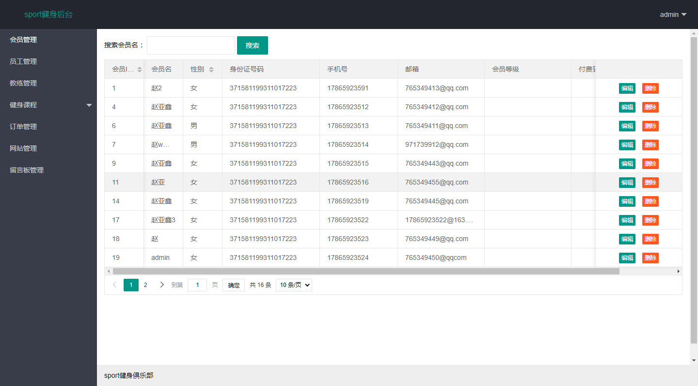

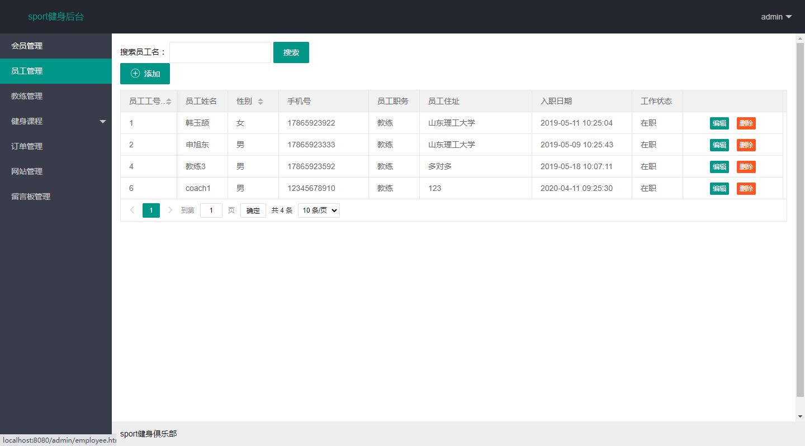

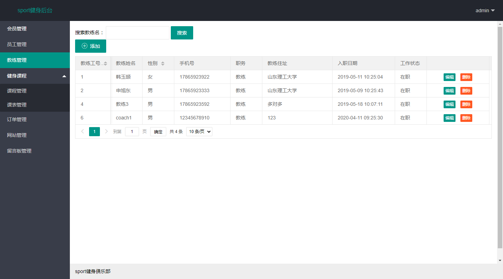

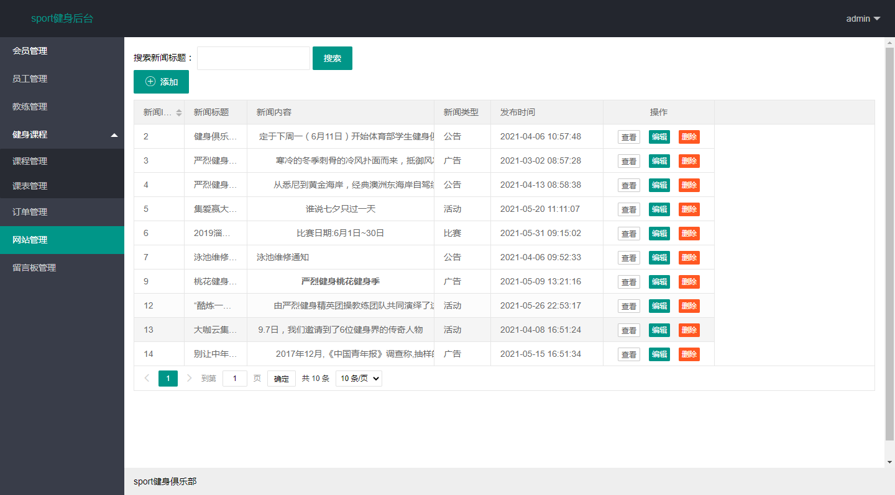

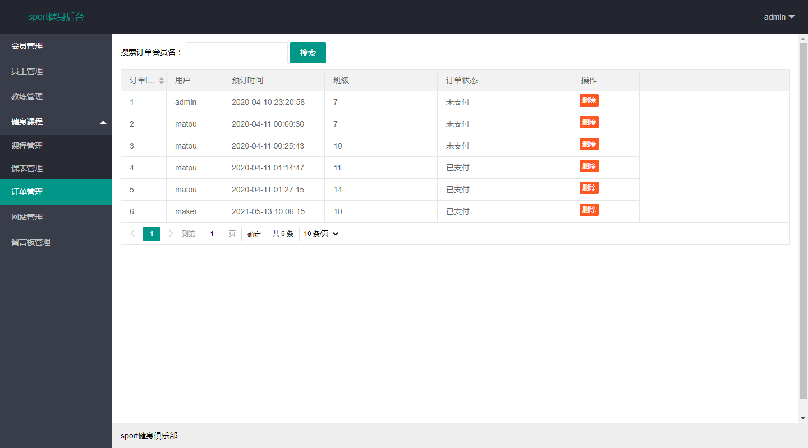

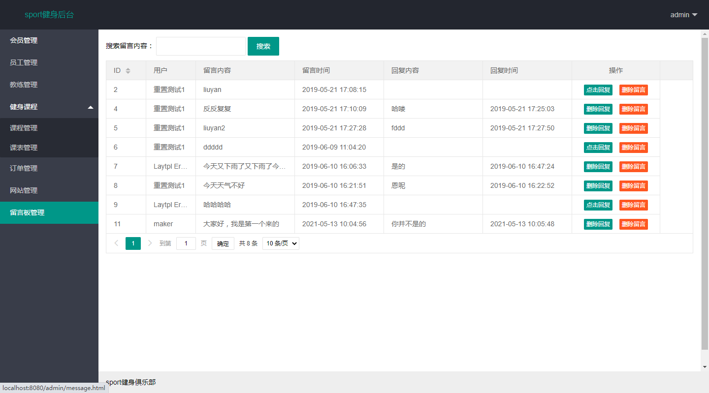

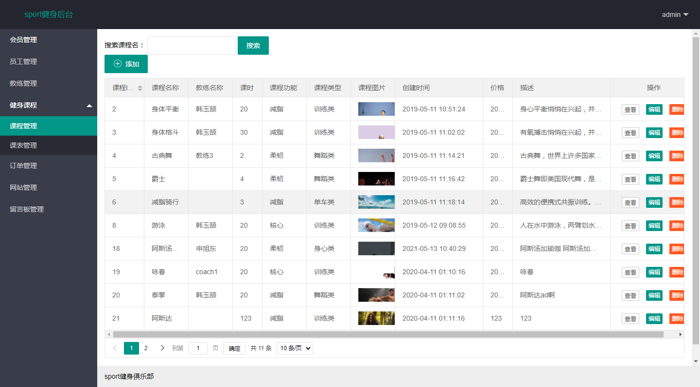

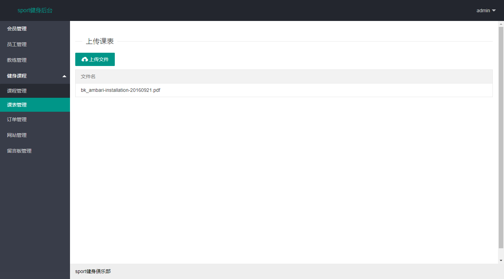

用户：

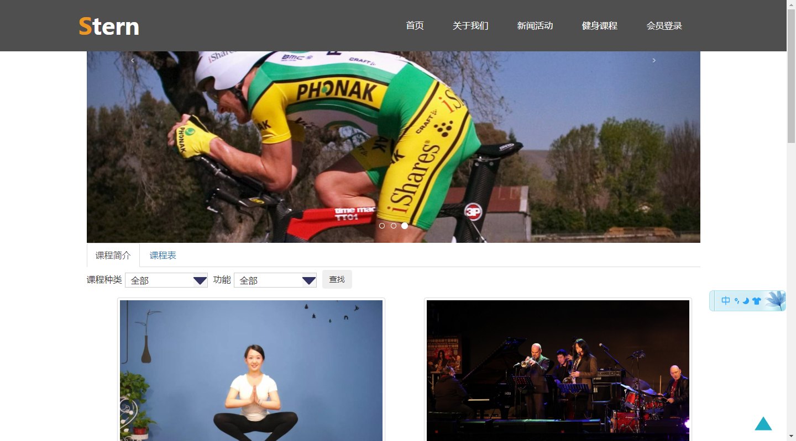

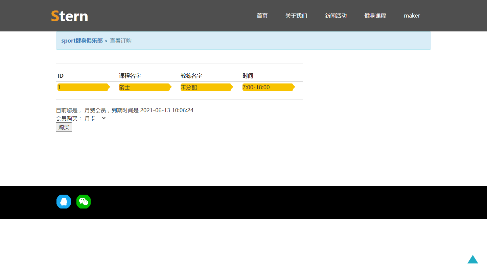

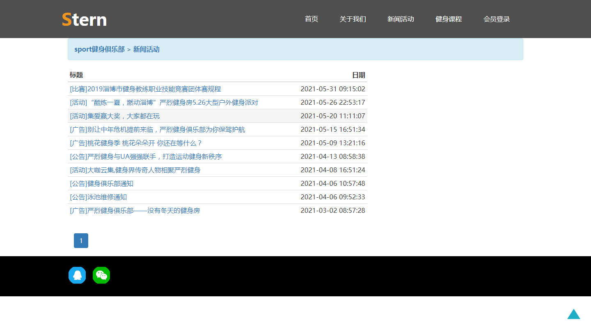

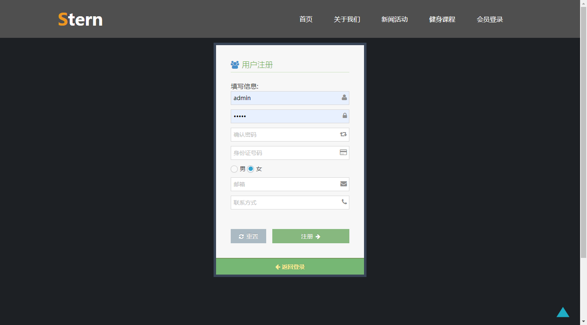

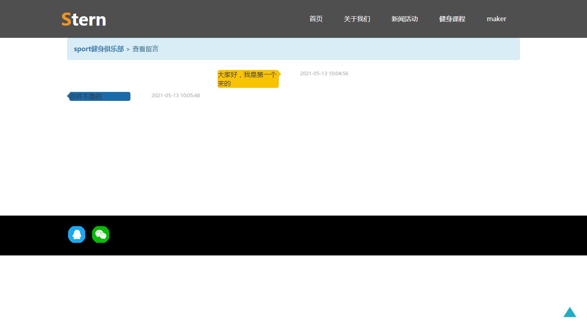

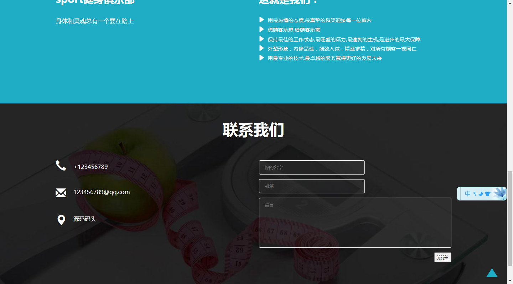

